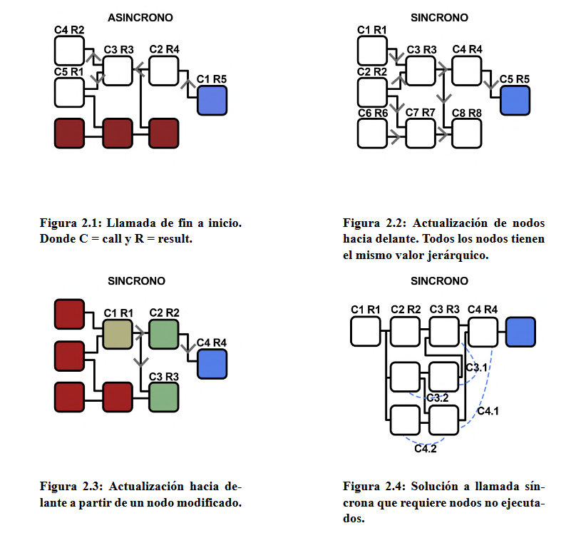

# Study-Image


 ## Creación de una aplicación que rellene las carencias de algunos softwares.

        
- Study Image debe pesar poco y ser rápida de ejecutar. El objetivo es evitar emplear otros programas más pesados con muchas funcionalidades que no se requieren para estudiar propiedades de las imágenes y los colores (Nuke, Davinci Resolve, photoshop...).

- Visual e intuitiva. Para evitar confusiones, debe mostrar paso a paso los procesos que lleva a cabo el usuario para ayudar a entender el procedimiento.

- Implementar OCIO. No es necesario emplear esta librería para hacer una correcta gestión de color pero, dado que es open source y utilizada por todos los programas mencionados anteriormente, ofrece la oportunidad de gestionar color a través de diferentes plataformas. El objetivo es poder crear y manipular una configuración ocio que puedas exportar a otras aplicaciones.

- Código simple y manipulable. Esta aplicación ofrece el código para poder crear módulos en función de las necesidades del usuario. Se sacrificará un poco de rendimiento con intención de facilitar la comprensión del código.

## Estructura interna

Image Study es una aplicación de nodos. El usuario puede crear códigos más complejos a partir de pequeñas cajas con funcionalidades muy concretas. Se ha elegido este método por ser un sistema empleado en una gran variedad de aplicaciones (blender, nuke, davinci resolve, fusion, unreal engine, unity).

La aplicación esta desarrollada completamente en python para una mayor accesibilidad a personas que no sepan mucho de programación y que quieran entender el código interno.

Los nodos son hijos de una clase que controla las conexiones, actualizaciones y datos. Con este método, añadir un nuevo nodo es tan fácil como declarar un hijo, su función y su nombre. 

```


study_image
├──modules
│  ├── __init__.py
│  ├──color_transform.py
│  ├──debugger.py
│  ├──father_class.py
│  ├──interaction.py
│  ├──loadders.py
│  ├──math.py
│  ├──operators.py
│  └──plotters.py
├── colormanagement
└── app.py

```

## Ejecución 
Por comodidad, se ha elegido un método síncrono que ejecuta de inicio a fin. Esto permite que cualquier ramificación del árbol se ejecute. Para evitar calcular de nuevo nodos que no han sufrido un cambio, cada nodo almacena en sus salidas el valor ejecutado, y la ID del nodo se almacena en una lista de nodos ya ejecutados. Si un nodo se modifica, el, y todos los nodos conectados por delante, desaparecen de la lista y se vuelven a ejecutar.

